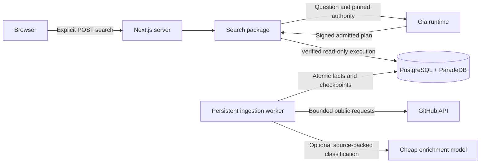

# Architecture

Gia GitHub is a TypeScript monorepo with a Next.js application, a persistent Node ingestion worker, PostgreSQL with ParadeDB, and an external Gia runtime. The browser never connects to PostgreSQL or receives a Gia credential.

## Package boundaries

`apps/web` owns presentation, request validation, and the server composition root. `packages/search` owns Gia calls, admission accounting, stable JSON contracts, and result hydration. `apps/worker` owns public data acquisition, normalization, enrichment, and durable jobs. `packages/db` owns relational schema, migrations, and connection construction. Packages do not import apps. `pnpm check:boundaries` follows browser imports and rejects server dependencies.

The two applications share ordinary typed functions. We use Drizzle for application writes and small explicit SQL statements for joins, migrations, permissions, and independent test expectations. There is no generic repository layer or event bus. pg-boss uses the same PostgreSQL instance, so durable jobs need no Redis service. The worker remains a separate process because ingestion can outlive an HTTP request.

## Search path

1. A user submits a question. The HTTP boundary validates it and attaches cancellation.
2. Shared database admission accounting bounds concurrent work and provider usage.
3. The search adapter asks Gia for identities from the generated accounts entity.
4. Gia plans relational filters and lexical search using the pinned World. The client verifies and executes the admitted plan through a read-only connection.
5. The adapter preserves returned identity order, deduplicates only duplicate identity rows when the public person contract requires it, and hydrates those people. It does not run a second planner or replace the result set.
6. The UI shows assumptions, unsupported requests, empty results, incomplete coverage, and failures as different outcomes.

Relational conditions handle membership, dates, distinct counts, and joins. ParadeDB BM25 handles text relevance. Versioned concepts normalize terms such as reranking and AI SDK. Keyword mentions retain inferred support; exact manifest dependencies carry explicit support. This is hybrid retrieval without profile vectors. We will add embeddings only after measured golden-query failures show a need.

## What the data can establish

Public organization membership establishes publicly visible affiliation at the observation time. It does not establish employment. Profile company and location are self-reported. A repository's language distribution does not establish personal proficiency. An author contributed a PR, but that does not make them a maintainer or an implementer of every repository capability.

Repository-level and PR-level concept evidence are separate. An identity-only Gia answer cannot prove which PR made a person match. Hydrated links therefore remain labeled profile context. Claiming query-specific evidence requires a separate admitted evidence projection and its own correctness proof.

All observations retain source identity and time. A missing or partial enumeration does not establish absence. Historical golden queries use fixed absolute dates, and production responses expose dataset coverage. Private memberships, private repositories, inferred sensitive traits, and email harvesting are outside this application.

## Keeping the scope small

The initial corpus is bounded public data, not a full GitHub mirror. Provider calls happen during explicit searches or bounded ingestion. We do not issue paid searches while rendering a page, building, prefetching, or typing. Source text is untrusted content, including README instructions and model-produced classifications.
